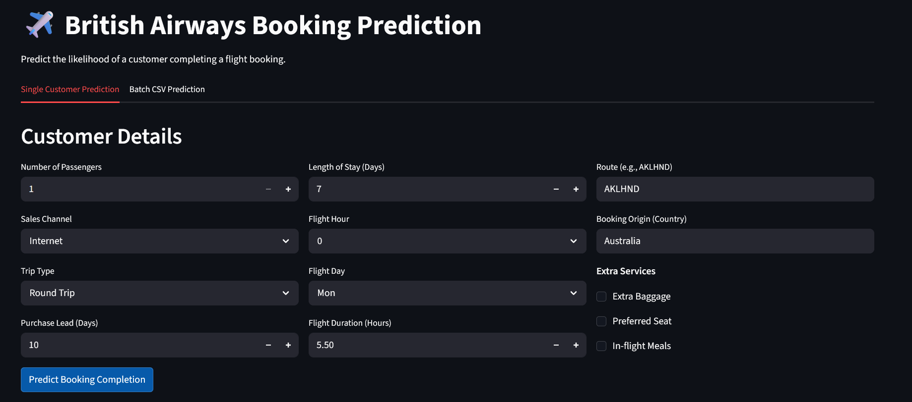

# ✈️ British Airways: Customer Booking Prediction

This project was developed as part of the Virtual Internship in Data Science organized by **British Airways** working on a real world flight booking dataset. The goal is to build a high performance machine learning model to predict the likelihood of a customer completing a flight booking based on their behavior and trip details.

---

## 📊 Project Overview
Predicting "Booking Completion" is a critical business task for British Airways. By identifying which customers are likely to finish the booking process, the marketing and sales teams can optimize their targeting strategies and improve conversion rates.

### Key Objectives:
* **Feature Engineering:** Extracting meaningful insights and interaction features from raw data (e.g., flight periods, stay types, and booking behavior).
* **Pipeline Architecture:** Building a robust, production-ready scikit-learn pipeline that integrates custom transformers.
* **Predictive Modeling:** Utilizing high-performance algorithms like **XGBoost**,**CatBoost**,etc to handle complex categorical data.
* **User Interface:** Deploying a **Streamlit** dashboard for real-time predictions.

---

## 🚀 The Prediction App

The app allows users to interact with the model in two ways:
1.  **Single Prediction:** Enter individual customer details to see an immediate result.
2.  **Batch Processing:** Upload a CSV file to generate predictions for thousands of records at once.

### App Preview


---

## 🛠️ Technical Stack
* **Core:** Python 3.10+
* **ML Frameworks:** Scikit-learn, CatBoost, Imbalanced-learn
* **Data Processing:** Pandas, NumPy
* **App Development:** Streamlit
* **Serialization:** Joblib

---

## 📈 Visualizing the Dashboard


---

## 📖 How to Use

### 1. Installation
Clone the repository and install the required dependencies:
```bash
git clone https://github.com/raaja-snd/British-Airways-buying-behaviour.git
cd ba-booking-prediction
pip install -r requirements.txt
```

### 2. Build the Pipelines
To generate the latest serialized pipeline files, run the pipeline builder:
```bash
python src/preprocessing/Pipeline.py
```

### 3. Launch the App
Run the Streamlit app from the project root:
```bash
streamlit run src/ui/app.py
```

---

## ✍️ Author
Developed with passion by:

**[Raaja Selvanaathan]** 📧 [raaja-selvanaathan.datchanamourthy@edu.dsti.institute](mailto:raaja-selvanaathan.datchanamourthy@edu.dsti.institute)  
🔗 [GitHub Profile](https://github.com/raaja-snd)  
👔 [LinkedIn Profile](https://www.linkedin.com/in/raaja-snd/)

---
*Disclaimer: This project is part of a virtual internship simulation and uses publicly available data provided by Forage for educational purposes.*
